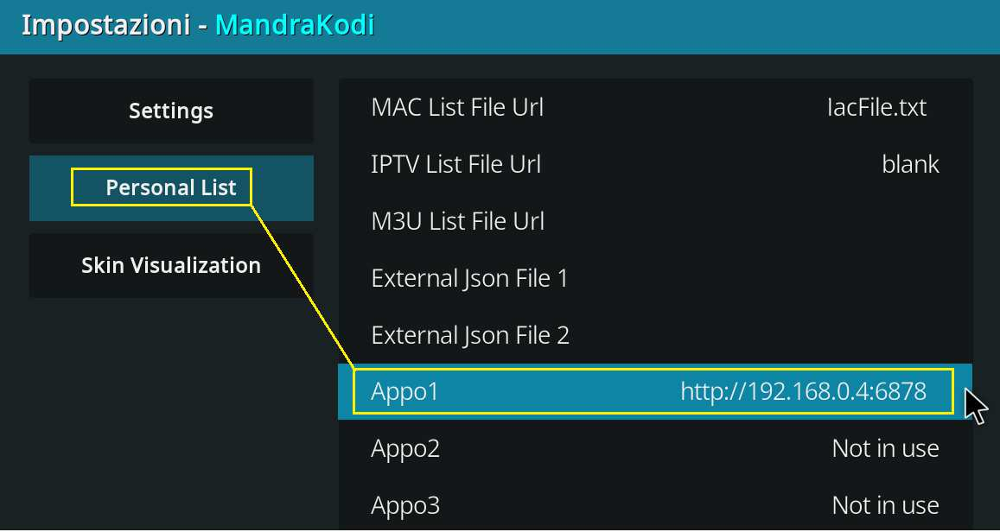

[:material-book-open-page-variant: Torna alle Guide](../guide/tutorials.md){ .md-button .md-button--primary }  [:material-home: Torna alla Home](../index.md){.md-button .md-button--primary} [:material-face-agent: Assistenza](../ask_help.md){ .md-button .md-button--primary }

------

!!! tip "Ace, flussi P2P ad alta qualità"
    Sono link che sfruttano un protocollo basato sulla condivisione di flussi streaming audiovisivi tramite rete **p2p** (peer to peer) il che vuol dire creare interconnessioni tra più utenti e il server proprio come accadeva anni or sono con eMule/Torrent Questo significa che “chi guarda in streaming, trasmette anche agli altri utenti, ovvero *più utenti guardano e condividono a loro volta ad altri* , *meno blocchi ci sono durante la visione*”: **questo avviene esclusivamente se sul proprio router viene aperta la porta 8621 udp**

!!! warning "Lingua contenuti"
    I link Ace sono **praticamente totalmente stranieri**, in quanto in Italia - salvo rare occasioni - poco utilizzati per mancanza della cultura di condivisione alla base di tutti i sistemi P2P come appunto Acestream, Emule, Torrent ecc

------

!!! important "Fase 1 - Installazione"
    **Installare** sul proprio dispositivo  

??? info "Acestream per Windows"
    **Installer per Windows**

    * <a href="https://download.acestream.media/products/acestream-full/win/latest" target="_blank">Windows</a> 
    * Avviare Acestream

??? info "AceServe per Android Smarthpone/Tablet/Chiavette/Tv/Box/Firestick"
    **Installer MOD per Android Android Smarthpone/Tablet/Chiavette/Tv/Box/Firestick**

    * <a href="https://www.dropbox.com/scl/fi/uz8q15arnixvo47e9odbm/Aceserve-1.5.5-32bit.apk?rlkey=lhvtazx8sfqmrbd4qdsfsw1l9&st=nzwzt76l&dl=1" target="_blank">Android ARMV7A 32bit</a> Chiavette/Tv/Box/Firestick (Android 9 - 12)
    
    * <a href="https://www.dropbox.com/scl/fi/sz1kjiwgtnww1bjsmryfn/Aceserve-1.5.5-64bit.apk?rlkey=u8ekpvc4yq14wzvrwburg7jis&st=86575k8p&dl=1" target="_blank">Android ARMV8A 36bit</a> Smartphone/Tablet (Android 12 - 16)
    * Avviare AceServe una prima volta per dare i permessi
    * Tornare alla home page col tasto dedicato per **lasciarlo aperto in background**

??? info "Acestream per Linux"
    **Pacchetti per Linux**

    * Installare Acestream a seconda della propria distribuzione in formato "**Snap**" o "**Flatpak**"
    * Avviare Acestream

------

!!! important "Fase 2 - Player interno Kodi / Player esterno (es. Vlc, Mx Player)"
    - "**ENGINE**":   sfrutta motore di Ace **rimanendo all'interno di Kodi**  usando il suo **player interno**                             (richieste più risorse hardware, solo per device con 2Gb Ram)
    - "**DIRETTO**":   sfrutta motore di Ace ma **esce da Kodi** usando un **player esterno** (es. Vlc, Mx Player)                             (richieste meno risorse hardware, per dispositivi con 1,5Gb Ram)  

??? info "Opzione **ENGINE**"
    **Play all'interno di Kodi**

    * Avviare Kodi
    * In Mandrakodi avviare un link Ace
    * Usare opzione "**ENGINE**"

!!! warning "ATTENZIONE"
    Per "Opzione DIRETTO" prima eseguire procedura per abilitare i "[Players Esterni](https://campipaolo.github.io/Mandrakodi-Wiki/guide/kodi_settings/)" (se non precedentemente eseguita)

??? info "Opzione **DIRETTO**"
    **Play con player esterno (es. Vlc, Mx Player)**

    * Avviare Kodi
    * In Mandrakodi avviare un link Ace
    * Usare opzione "**DIRETTO**"
    * Selezionare "**org.free.aceserve**"
    * Selezionare player esterno (es. Vlc, Mx Player)

------

!!! important "EXTRA - AceServe con dispositivi poco performanti"
    Con *dispositivi poco performanti*  (tv/chiavetta con 1Gb/1,5Gb Ram e 8Gb storage) è consigliabile eseguire AceServe su **altro dispositivo** (generalmente smartphone) **purché connesso alla medesima rete,**  sfruttando maggiori risorse per cache disco e ram 

??? info "Kodi su Tv/Chiavetta + AceServe su Android Smartphone/Tablet"
    **Eseguire AceServe su dispositivo terzo**

    * Installare AcesServe su smartphone/tablet
    * Avviare AcesServe sullo smartphone
    * Avviare Kodi su Tv/Chiavetta, dalla pagina principale, scorrere su addon
    * Tenere premuto sull'icona di Mandrakodi, poi "Impostazioni"
    * Nella scheda "**Personal List**", poi "**Appo1**", copiare come da foto inserendo IP smartphone
      
    * N.B.: **IP smartphone** è visibile dalle proprietà della connessione Wifi
    * In Mandrakodi provare un qualunque link ace sempre e solo con opzione “**ENGINE**”

