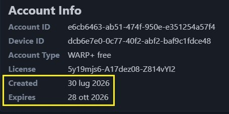

[:material-book-open-page-variant: Torna alle Guide](../guide/tutorials.md){ .md-button .md-button--primary }  [:material-home: Torna alla Home](../index.md){.md-button .md-button--primary} [:material-face-agent: Assistenza](../ask_help.md){ .md-button .md-button--primary }

------

!!! tip "Warp / Wireguard"
    Sono richiesti per alcuni link iinseriti in Mandrakodi contrassegnati con dicitura  "**WARP**"       - **Warp** (Windows/macOS/Linux/Android/iOS) *[si installa da qui](https://one.one.one.one)*, **non richiede** alcuna configurazione      - **Wireguard** (AndroidTv/Firestick) una volta installato **necessita** del file ".conf" per funzionare correttamente 

!!! warning "Attenzione"
    File ".conf" è utilizzabile su *più dispositivi contemporaneamente* da stessa rete e tra reti diverse   **Sconsigliamo** di **condividere** il proprio file .conf **con più utenti**, ad esagerare finisce che Cloudlfare poi impone un   file diverso per ogni dispositivo e pure per ogni tipologia di rete....

------

!!! important " Fase 1 - creare file configurazione per Wireguard"
    Esistono più metodi per creare file ".conf" da utilizzare in WIreguard su AndroidTv/Firestick      - Sito Config Generator (**scadenza 90gg**)      - Windows/macOS/Linux con "WGCF" (**nessuna scadenza**)      - Smartphone Android con app "Termux" (**nessuna scadenza**)

??? info "Sito Config Generator"
       **Scadenza 90gg**

    * [Config Generator](https://lanrat.github.io/wireguard-warp-generator/) 
    * Premere il pulsante "Generate Warp Config"
    * Premere il pulsante "**Download warp.conf**"
    * Il file così creato, ha una durata di 90 giorni trascorsi i quali va rigenerato
      
    * N.B.: verificare che il file salvato abbia l'estensione "**.conf**" (se necessario **rinominarlo**)

??? info "Windows/macOS/Linux con WGCF"
       **Nessuna scadenza**

    * [WGCG](https://github.com/ViRb3/wgcf/releases) 
    * Scorrere fino alla sezione "Assets" (premere "Show All" per espandere l'elenco)
    * Windows 64bit: wgcf_x.x.x_windows_amd64.exe 
      Windows ARM: wgcf_x.x.x_windows_arm64.exe 
    * Copiare il file scaricato sul **Desktop**
    * **Rinominarlo** in "wgcf.exe"
    * Premere il tasto Windows, scrivere "cmd" e premere invio
    * Digitare "cd desktop" e premere invio
    * Digitare "wgcf.exe register" e premere invio
    * Quando richiesto andare su "Yes" e premere invio
    * Digitare "wgcf.exe generate" e premere invio
    * Sul desktop saranno presenti due file, l'unico da conservare è "wgcf-profile.conf"

??? info "Smartphone Android con app Termux"
    **Nessuna scadenza**

    * [Termux Play Store](https://play.google.com/store/apps/details?id=com.termux&hl=it) 
    * Installare ed avviare 
    * N.B.: di seguito comandi da copiare e poi incollare in termux, **uno alla volta** (quando richiesto premere invio alla domanda "Y" o scrivere Yes per confermare) 
    * termux-setup-storage (abilitare permesso scrittura  su dispositivo)
    * pkg install wget
    * pkg install git 
    * git clone https://github.com/ViRb3/wgcf
    * cd wgcf
    * pkg install golang
    * go mod download
    * go build -o wgcf
    * chmod +x wgcf
    * ./wgcf register
    * ./wgcf generate
    * ./wgcf status
    * ls
    * cp wgcf-profile.conf ~/storage/downloads
    * ls ~/storage/downloads
    * exit
    * N.B.: il file ".conf"  sarà reperibile nella cartella **Download** del prprio device

------

!!! important " Fase 2 - Wireguard"
    **Installare** su  **AndroidTv** / Scaricare **Apk** per **Firestick** 

??? info "Wireguard"
    **AndroidTv/Firestick**

    * [Wireguard](https://download.wireguard.com/android-client/)
    
    * Utenti **AndroidTv**: installare con link "Google Play Store"
    * Utenti **Firestick**: Scaricare "com.wireguard.android-x.x.xxxxxxxx.apk"

------

!!! important " Fase 3 - Localsend"
    **Inviare** a AndroidTv/Firestick file ".conf" ed eventuale Apk Wireguard per Firestick

??? info "Localsend"
    **Windows/macOS/Linux/Android/AndroidTv/iOS/Firestick**

    * Installare "Localsend" su entrambi i dispositivi "mittente" e "ricevente"
    * [Loalsend Windows/macOS/Linux/Android/AndroidTv/iOS](https://localsend.org/it/download)
    * Utenti **Firestick**: provare una o più fonti 
    [F-Droid](https://f-droid.org/packages/org.localsend.localsend_app/): scaricare apk versione "armeabi-v7a" 
    [Github](https://github.com/localsend/localsend/releases): scaricare apk "LocalSend-x.xx.x-android-arm32v7.apk" 
    * Avviare Localsend **prima** sul dispositivo "ricevente" e **poi** su quello "mittente"
    * Sul dispositivo "mittente" premere "Invia" e poi "File" 
    * Selezionare file/files da inviare
    * Selezionare dispositivo "ricevente"
    * Sul dispositivo "ricevente" dare conferma per ricevere  
    * N.B.: la cartella "**Download**" è quella di default per la ricezione
    * Sul dispositivo "ricevente" in alto a destra l'icona a fianco alla “i” elenca la cronologia

------

!!! important " Fase 4 - Installare WIreguard su  Firestick "
    **Installazione** Apk Wireguard per **Firestick**

??? info "Wireguard per Firestick"
    **Firestick**

    * Sul dispositivo "ricevente" in alto a destra l'icona a fianco alla “**i**” elenca la cronologia dei file ricevuti
    * Cliccare apk Wireguard 
    * Consentire installazione delle app da Localsend (se richiesto) e installarlo
    * Alla prima apertura, WireGuard potrebbe chiedere il permesso di accedere ai file
    * Concedere l'autorizzazione, se non appare richiesta, uscire e rientrare

------

!!! important " Fase 5 - Configurare Wireguard"
    **Impostare** Wireguard su AndroidTv/Firestick

??? info "Wireguard"
    **AndroidTv/Firestick**

    * Aprire Wireguard, premere il pulsante "+" e selezionare l'opzione "importa da file"
    * Importato il file ".conf", sarà presente nella schermata principale 
    * Cliccare l'interruttore in corrispondeza sulla destra per attivare/disattivare
    * Al primo avvio verrà chiesta conferma di attivazione
    * N.B.: qualora non fosse possibile selezionare il file ".conf" durante l'importazione, installare dallo Store **file manager** come "x-plore " o simili

------

!!! important " EXTRA - WG Tunnel (sempre con file ".conf")"
    Installare **alternativa** "WG Tunnel" su Windows/Linux/Android/AndroidTv/Firestick

??? info "WG Tunnel"
    **Windows/Linux/Android/AndroidTv/Firestick**

    * Installare WG Tunnel
    * [WG Tunnel AndroidTv/Firestick 32bit](https://github.com/wgtunnel/android/releases/) wgtunnel-standalone-vx.x.x-armv7.apk
    * [WG Tunnel Android 64bit](https://github.com/wgtunnel/android/releases) wgtunnel-standalone-vx.x.x-armv64.apk
    * [WG Tunnel Windows 64bit](https://github.com/wgtunnel/desktop/releases) wgtunnel-x.x.x.x64.msix
    * [WG Tunnel Linux 64bit](https://github.com/wgtunnel/desktop/releases) wgtunnel_x.x.x_amd64.deb
    * Avviare WG Tunnel
    * Alla prima apertura, WG Tunnel potrebbe chiedere il permesso di accedere ai file
    * Aperto WG Tunnel, premere il pulsante "+" e selezionare l'opzione "importa da file"
    * Importato il file ".conf", sarà presente nella schermata principale 
    * Cliccare l'interruttore in corrispondeza sulla destra per attivare/disattivare
    * Al primo avvio verrà chiesta conferma di attivazione

