[Torna alla Home](../index.md){.md-button .md-button--primary}

------

[ :material-arrow-right-bold: Impostazioni Kodi](kodi_settings.md){.md-button .md-button--primary}  [ :material-arrow-right-bold: Assistenza ](ask_help.md){.md-button .md-button--primary} 

------

!!! warning "Importante"
    Qualora Kodi fosse **pre installato** senza essere sicuri se installato con installer preso da sito, disinstallare e procedere seguendo istruzioni di seguito a seconda del Sistema Operativo 

!!! important "Attenzione"
    Per un pieno funzionamento di Kodi con tutte le sue dipendenze corrette, **scaricare Kodi dal proprio sito** per i vari Sistemi Operativi seguendo i passaggi sotto riportati

------

!!! tip "Fase 1 - Installazione"
    Installare Kodi sul proprio dispositivo

??? info "Kodi per Windows"
    **Installer per Windows**

    * [Download Windows](https://kodi.tv/download/windows/) 
    * Selezionare sezione "Recommended"
    * Scaricare Installer 32bit o 64bit (NON Windows Store)

??? info "Kodi per Android / Android TV"
    **Installer per Android / Android TV**

    * [Download Android/AndroidTv](https://kodi.tv/download/android/)
    * Selezionare sezione "Recommended"
    * Scaricare Installer ARMV7A 32bit (Android TV fino v12) o ARMV8A 64bit (Smartphone/Tablet/Android TV >14)

??? info "Kodi per macOS"
    **Installer per macOS**

    * [Download macOS](https://kodi.tv/download/macos/)
    * Selezionare sezione "Recommended"
    * Scaricare Installer Intel (x86_64) o ARM64

??? info "Kodi per Linux"
    **Installer Flatpak**

    * [Download Linux](https://flathub.org/en/apps/tv.kodi.Kodi)
    * Premere pulsante "Install" o installare dal proprio Store
    * Da terminale digitare:
    
      ```bash
      sudo flatpak install flathub tv.kodi.Kodi
      ```

------

!!! tip "Fase 2 - Installazione addon"
    Installare l'addon Mandrakodi

??? info "Mandrakodi"
    **Guida all'installazione**

    * **Fase 1: Inserimento Sorgente**
      1. Cliccare sulla rotellina delle impostazioni:
    
         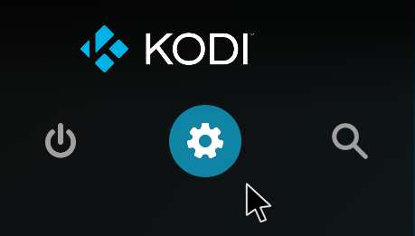
    
      2. Cliccare su **File**:
    
         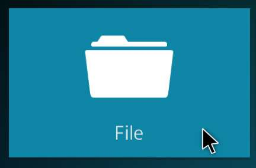
    
      3. Nella maschera che compare (Gestore File), cliccare su **Aggiungi sorgente**:
    
         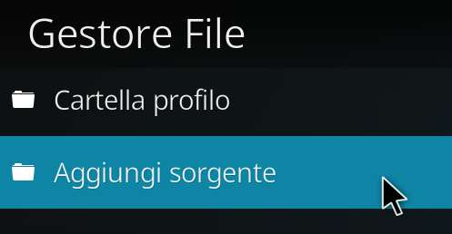
    
      4. Nella maschera, cliccare su **Nessuno**:
    
         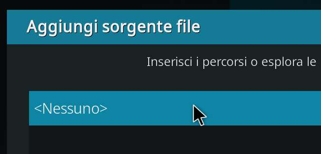
    
      5. Nella nuova maschera, inserire l'URL `https://mandrakodi.github.io` e poi premere **OK**:
    
         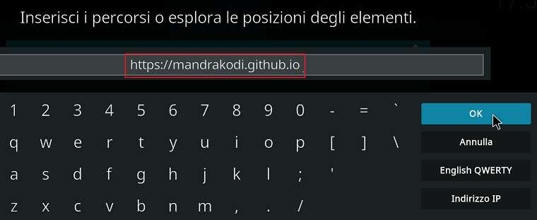
    
      6. Nella maschera cliccare nello spazio vuoto sotto *"Inserisci un nome per questa sorgente elementi"*:
    
         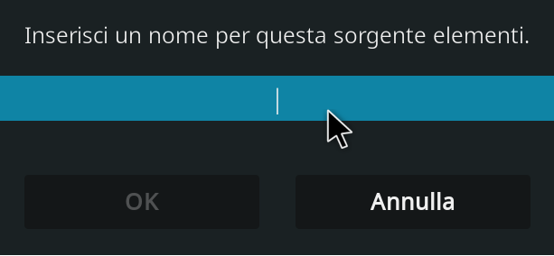
    
      7. Inserire un nome qualunque e premere **OK**:
    
         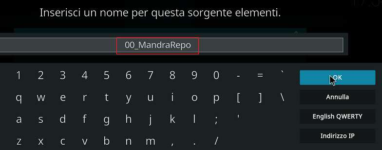
    
      8. Nella maschera, a questo punto, si è attivato il pulsante **OK** per aggiungere la sorgente. Cliccatelo:
    
         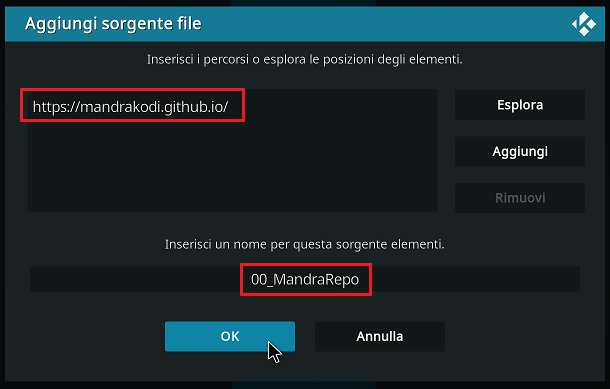
    
      9. Adesso, nella maschera Gestore File, vi comparirà il nome che avete scelto:
    
         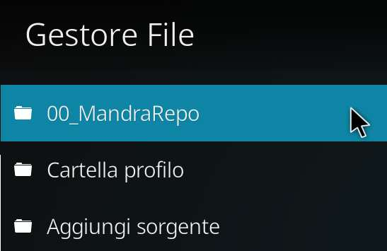
    
    * **Fase 2: Installazione Add-on**
      *Pre-requisito: Installare dal Repository Ufficiale l'add-on YouTube (questo passaggio scaricherà dei componenti aggiuntivi necessari per MandraKodi)*
    
      1. Cliccare sulla rotellina delle impostazioni:
    
         
    
      2. Nella maschera che compare, cliccare su **Add-on**:
    
         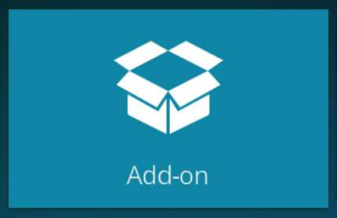
    
      3. Nella nuova maschera, selezionare **Installa da file zip**:
    
         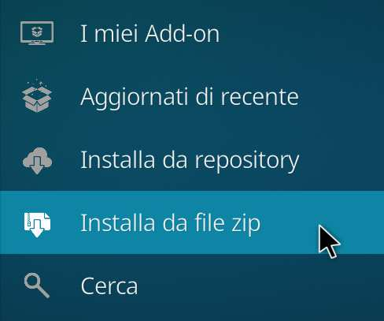
    
         * **A.** Se è la prima volta che installate un add-on non ufficiale, vi comparirà questa maschera:
    
           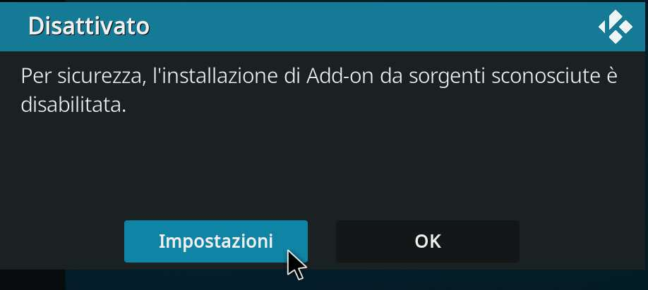
    
         * **B.** Cliccare su **Impostazioni** e, nella nuova maschera, attivare **Sorgenti sconosciute**:
    
           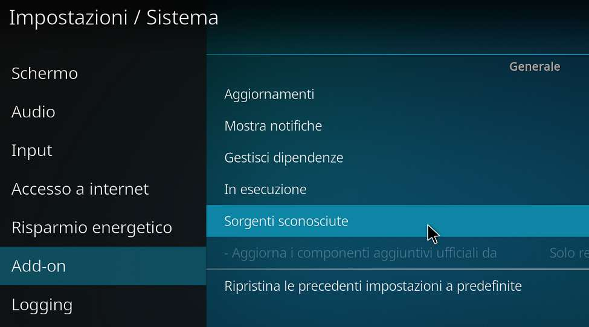
    
         * **C.** Comparirà un altro avviso dove bisogna rispondere **SÌ**:
    
           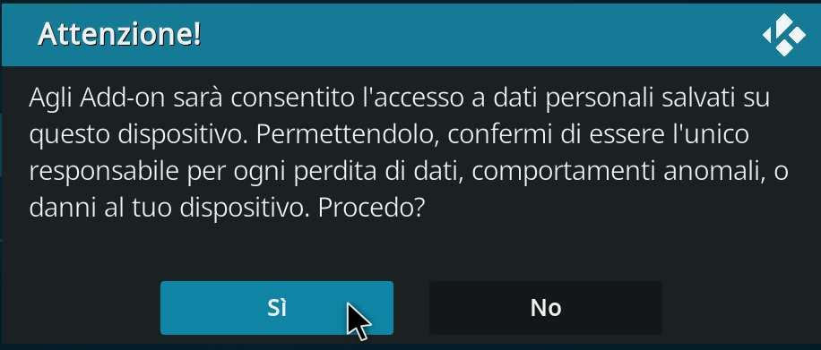
    
      4. Se avete già attivato le "Sorgenti sconosciute", comparirà questo avviso. Cliccare su **SÌ**:
    
         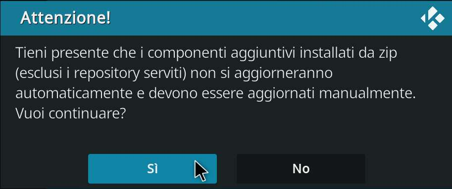
    
      5. Nella maschera selezionare il nome della sorgente di MandraKodi:
    
         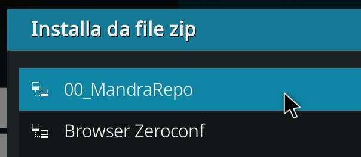
    
      6. Nell'elenco che compare, selezionare il file `plugin.video.mandrakodi-2.2.1a.zip` (o la versione attualmente disponibile):
    
         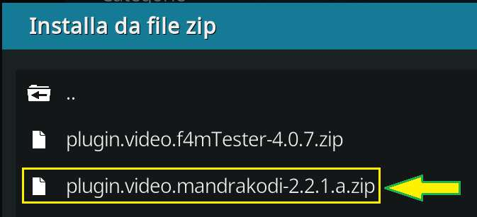
    
      7. Attendere fino a quando non compare il messaggio *"Add-on installato"*:
    
         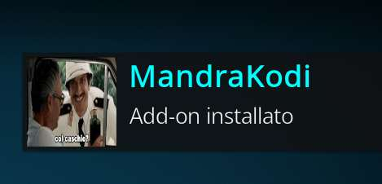
    
    * **Fase 3: Installazione script aggiuntivi**
      
      **A) Script.module.resolveurl**
      * Ripetere i passaggi 1 – 5 fatti per l'installazione dell'add-on MandraKodi.
      * Nell'elenco che compare, selezionare il file `script.module.resolveurl-5.1.92.zip` (o la versione attualmente disponibile):
    
        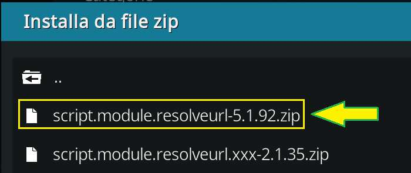
    
      * Attendere fino a quando non compare il messaggio *"Add-on installato"*:
    
        
    
      **B) Script.module.resolveurl.xxx**
      * Ripetere i passaggi 1 – 5 fatti per l'installazione dell'add-on MandraKodi.
      * Nell'elenco che compare, selezionare il file `script.module.resolveurl.xxx-2.1.35.zip` (o la versione attualmente disponibile):
    
        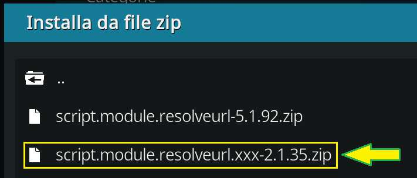
    
      * Attendere fino a quando non compare il messaggio *"Add-on installato"*:
    
        
    
    * **Fase 4: Configurazione addon**
      1. Cliccare sulla rotellina delle impostazioni:
    
         
    
      2. Nella maschera che compare, cliccare su **Add-on**:
    
         
    
      3. Nella nuova maschera, selezionare **I miei Add-on**:
    
         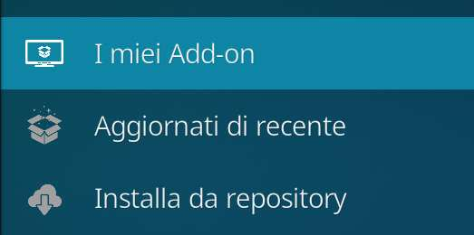
    
      4. Nella nuova maschera, selezionare **Addon video**:
    
         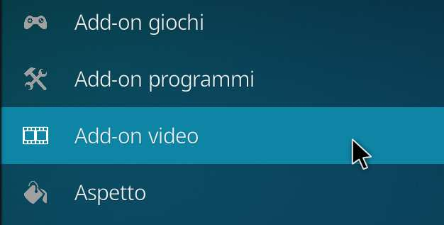
    
      5. Selezionare l'add-on **MandraKodi**:
    
         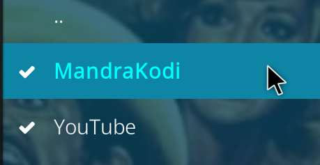
    
      6. Nella maschera dell'add-on, selezionare **Configura**:
    
         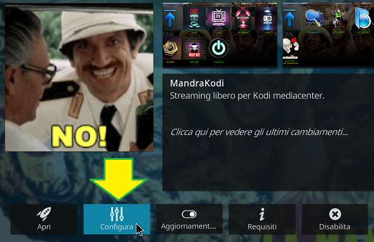
    
      7. Nella maschera inserire l'URL preso dal bot `@mandrakodibot` e premere **OK**:
    
         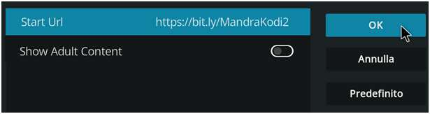
