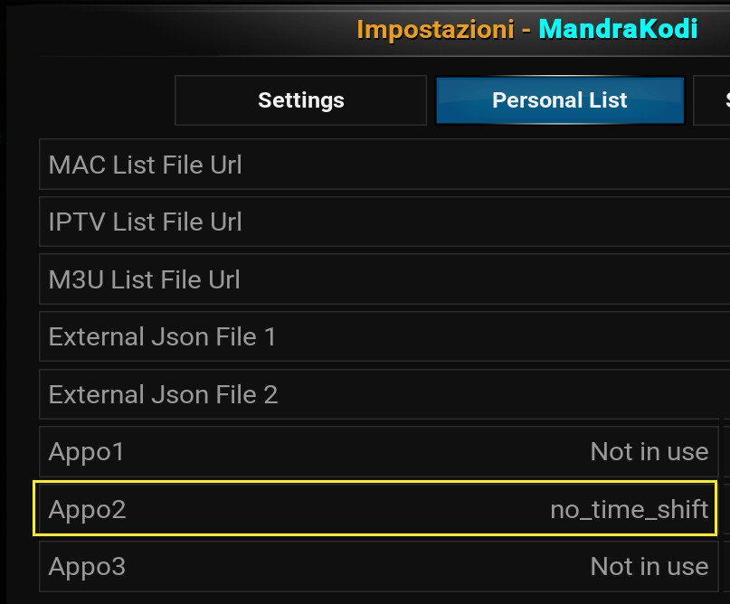

[Tornaa all'installazione](../installazione/install.md){.md-button .md-button--primary} [Torna alla Home](../index.md){.md-button .md-button--primary} 

------

!!! important "Importante"
    Di seguito settaggi consigliati per migliori prestazioni dei vari flussi video 

!!! tip "Flussi MPD"
    I link MDP sfruttano la libreria di kodi "**inputstream-adaptive**" che regola automaticamente la risoluzione video del flusso a seconda della propria connessione e del dispositivo.
E' possibile sia impostare dei valori min/max sia selezionare una risoluzione video a piacimento tra quelle disponibili per ogni flusso video 

??? info "Impostazioni Flussi MPD"
    **Avviare Kodi**

    * Impostazioni, "Addon", "I miei addon" "Lettore Video Inputstream", Inputstream Adaptive" 
    * "Lettore Video Inputstream", Inputstream Adaptive", "Configura"
    * Tipo selezione del flusso: "OSD manuale"
    * Risoluzione massima:  "1080p"
    * Risoluzione minima:  "1080p"
    * Premere "OK" per confermare

!!! warning "Come cambiare risoluzione video"
    Mentre si è in play, tasto centrale del telecomando o toccare touch smartphone   In basso a destra icona a forma di ingranaggio, "impostazioni video", "traccia video'   Si apre finestra con elencate le varie risoluzioni video disponibili da poter selezionare

!!! tip "Flussi DaddyLive"
    I canali **DaddyLive**, utilizzano il plugin **inputstream.ffmpegdirect**.
    Questo plugin, di default, utilizza la funzione **TimeShift** per permettere il riavvolgimento della live.    Per farlo, salva dei     file nella cartella di Kodi che vengono cancellati quando si ferma il video.    Su device con poca memoria (esempio la FireStick), può creare problemi. 

??? info "Impostazioni Flussi DaddyLive"
    **Avviare Kodi**

    * Tenere premuto/tasto destro su icona dell'addon Mandrakodi 
    * "Impostazioni"
    * Sezione "Personal List" poi "app02"
    * All'interno scrivere "no_time_shift"
    
    * Uscire da Kodi e rientrare

!!! tip "Buffer/Cache"
    Kodi ha un suo sistema interno per gestire **cache con modalità buffer** impostabilando una dimensione memoria per varie tipologie di flussi online/locali

??? info "Buffer/Cache"
    **Avviare Kodi**

    * Impostazioni, **"Servizi"**
    * In basso a sinistra cliccare sul pulsante **"Base"** fino a selezionare **"Esperto"**
    * Sulla sinistra compare il menu **"Cache"**
    * Modalità Buffer: selezionare **"Buffer di tutti i file system internet"**
    * Dimensione Memoria: **"64 MB"**
    * Uscire da Kodi e rientrare

!!! warning "Attenzione"
    Si ricorda che, in ogni caso, **quando il server della fonte è sovraccarico il buffering persiste comunque**.

